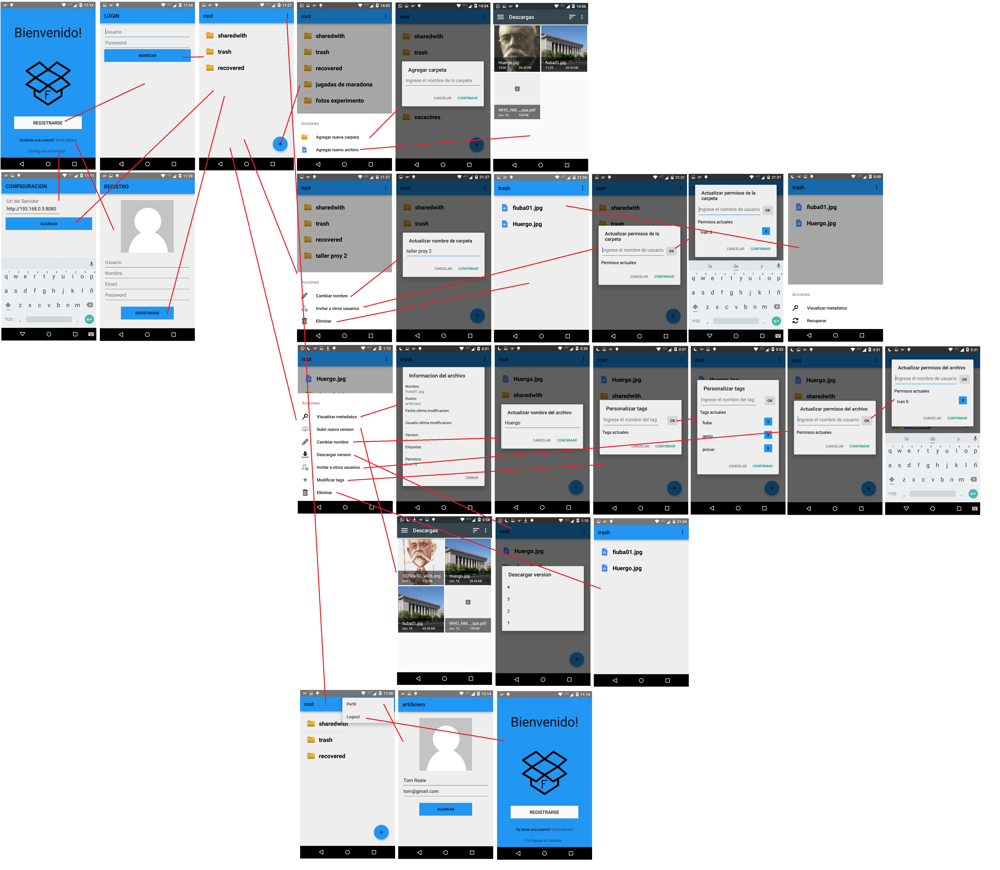

Diseño
======

Diagrama de clases
------------------

A continuación se puede observar el diseño del servidor a partir de las clases y sus relaciones.

.. figure::  clases.jpg
   :target: _images/clases.jpg

Para ver con más detalle las clases, ver el siguiente `link`_.

.. _link: ../../../doxygen/html/index.html

Flujo de actividades
-----------------------------

El presente diagrama refleja las actividades del cliente. Se pueden observar las principales pantallas de la aplicación y las relaciones entre dichas actividades.

