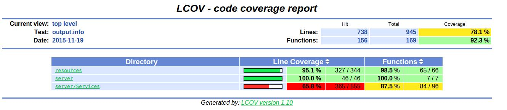

Pruebas
=======

Para realizar tests unitarios, se utilizó `google test <https://code.google.com/p/googletest>`_ junto `google mock <https://code.google.com/p/googlemock>`_, el cual facilitó el mockeo de la base de datos.

Para generar el informe de code coverage, utilizamos la herramienta `lcov <http://ltp.sourceforge.net/coverage/lcov.php>`_.

En cuanto al testing de la api, se realizaron scripts en python que hacen uso de las librerías `requests <http://docs.python-requests.org/en/latest>`_ y `unittest <https://docs.python.org/2/library/unittest.html>`_.

