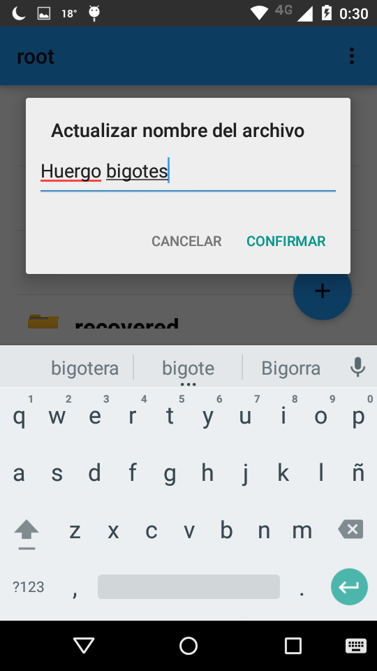
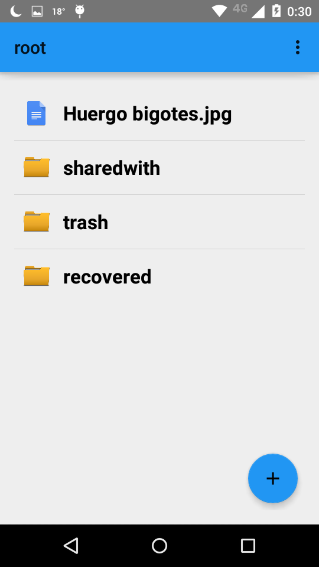

Acciones sobre archivo
======================

Hay 2 formas de interactuar con 1 archivo:

*	**Dandole un toque**
*	**Manteniendo presionado**

**Un toque equivale a abrir el archivo**

**Mantener presionado despliega un menu con opciones**

.. warning:: No se pueden modificar el contenido de archivos que se encuentran en la carpeta **trash**! Al mantener presionado sobre uno de estos archivos eliminados , las opciones que aparecen son Visualizar metadatos o Recuperar

Abrir archivo
--------------------

Click sobre el archivo que se quiere ver ( no mantener presionado, solo un toque rapido)

Elegir con que app abrir el archivo ( ver que extension sea compatible con esa aplicación)

Visualizar metadatos
--------------------

Mantener presionado ( aproximadamente 1/2 segundo ) sobre el archivo

Modificar nombre
----------------

Mantener presionado ( aproximadamente 1/2 segundo ) sobre el archivo

Modificar tags
--------------

Mantener presionado ( aproximadamente 1/2 segundo ) sobre el archivo

Se pueden agregar varios tags, escribiendo y luego haciendo click en OK

Si ahora vamos a ver los metadatos del archivo, vamos a ver los nuevos tags creados recientemente

Compartir / no compartir archivo
--------------------------------

Mantener presionado ( aproximadamente 1/2 segundo ) sobre el archivo

Al confirmar, el archivo le aparecera al otro usuario en su carpeta **sharewith**

Subir nueva versión
-------------------

Mantener presionado ( aproximadamente 1/2 segundo ) sobre el archivo

Elegimos la imagen de arriba a la izquierda como ejemplo

Un pop up nos informa que se le subio la version al archivo

Si vemos los metadatos, podemos ver que se actualizaron varios campos

*	usuario ultima modificacion
*	fecha ultima modificacion
*	numero de version

Si abrimos el archivo Huergo.jpg ( un simple click ) veremos que la imagen ya no es la que era antes

Descargar version
-----------------

Mantener presionado ( aproximadamente 1/2 segundo ) sobre el archivo

Esto nos muestra todas las versiones del archivo ( una por cada vez que fue modificado )
Al elegir 1 , se descargara esa

Eliminar archivo
----------------

Mantener presionado ( aproximadamente 1/2 segundo ) sobre el archivo

Click eliminar archivo. Inmediatamente se mueve el archivo a la carpeta **trash**

Recuperar archivo eliminado
---------------------------

En la carpeta **trash** se encuentran los archivos que fueron eliminados.
Con un toque, se pueden abrir para visualizar.
Si se mantiene presionado, se muestran solo estas 2 opciones :

.. figure::  opcionesEnTrash.png
   :target: _images/opcionesEnTrash.png

Una permite ver los metadatos.
La otra, recupera el archivo, sacandolo de **trash** y ubicandolo en **recovered**