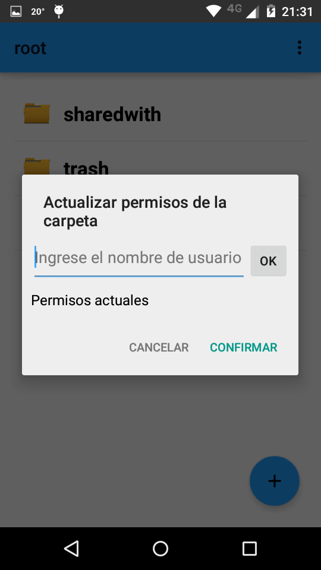
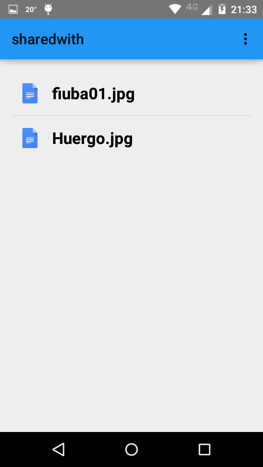

Acciones sobre carpeta
======================

Hay 2 formas de interactuar con 1 carpeta:

*	**Dandole un toque**
*	**Manteniendo presionado**

**Un toque equivale a ingresar a la carpeta, y ver su contenido**

**Mantener presionado despliega un menu con opciones**

.. warning:: No se pueden modificar o eliminar las carpetas creadas por el sistema! Si se mantiene presionada sobre una, en vez de un menu con opciones, aparecera un pop up "Carpetas especiales sin acciones".	

Modificar nombre
----------------

Mantener presionado ( aproximadamente 1/2 segundo ) sobre la carpeta que se quiere modificar

.. figure::  modificarCarpeta2.png
   :target: _images/modificarCarpeta2.png

Eliminar carpeta
----------------

Mantener presionado ( aproximadamente 1/2 segundo ) sobre la carpeta que se quiere modificar

.. figure::  modificarCarpeta2.png
   :target: _images/modificarCarpeta2.png

Click en Eliminar

La carpeta taller proy 2 tenia 2 archivos, que ahora apareceran en la carpeta **trash**

Esa carpeta no aparecera mas en el listado, ya que fue borrada.

Compartir carpeta
-----------------

Mantener presionado ( aproximadamente 1/2 segundo ) sobre la carpeta que se quiere modificar

.. figure::  modificarCarpeta2.png
   :target: _images/modificarCarpeta2.png

Click en Invitar a otros Usuarios

.. figure::  compartirCarpeta1.png
   :target: _images/compartirCarpeta1.png

Se pueden agregar varios usuarios con los que compartir, de a 1 por vez

Al hacer click en Confirmar , los archivos que esten dentro de esa carpeta le apareceran al otro usuario en su carpeta **sharewith**

Esto es lo que veria el otro usuario al que se le compartio la carpeta ( ya que la carpeta taller proy 2 contiene estos 2 archivos) :

