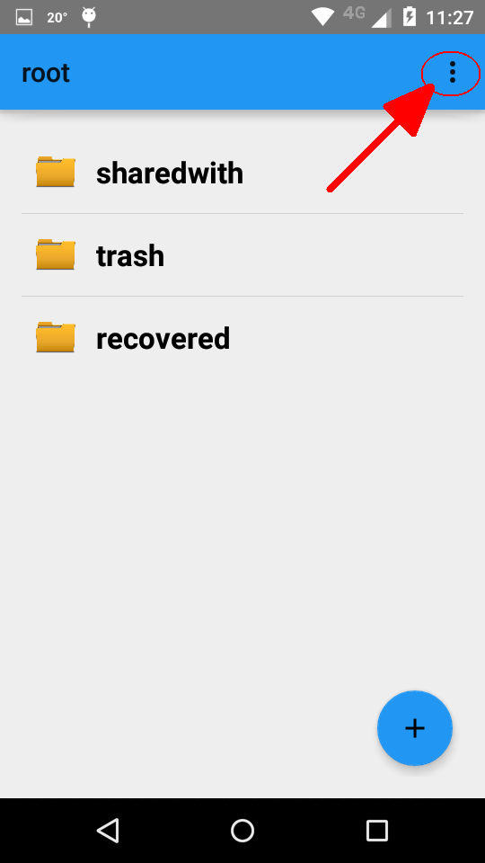
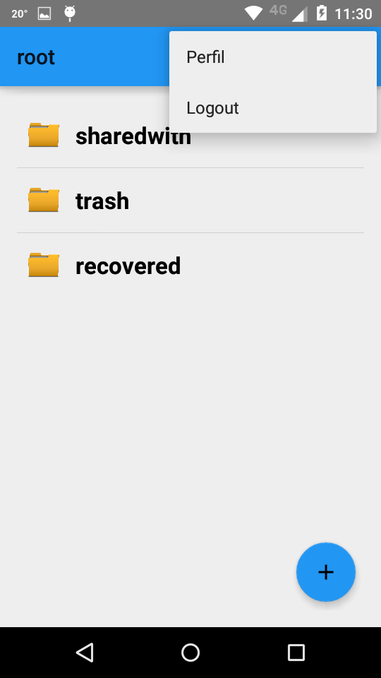

Cierre de sesión
================

Si se minimiza o se cambia el foco abriendo otra aplicación, Udrive queda ejecutandose en 2do plano.
Al volver a maximizarla, se volvera a donde sea que se estaba antes.

Para cerrar la aplicación, es necesario desloguearse.

Para desloguearse , hacer click en los 3 puntos arriba a la derecha :

Clickear Logout. Se volvera a la pantalla de bienvenida.