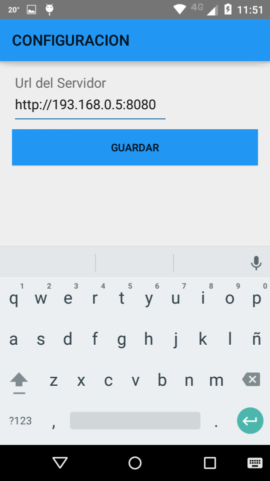
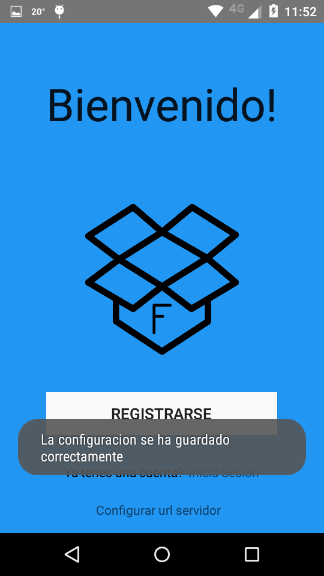

Configuración URL del servidor
==============================

Desde la pantalla inicial, se hizo click en "Configurar url servidor".

Para que la aplicación funcione correctamente, es necesario conocer la IP y el puerto donde esta atendiendo el servidor.

Es tan simple como escribirla en el campo Url del Servidor, y luego clickear en guardar.

El formato es http://<IP>:<Puerto>

Al guardar y volver, nos aparecera un pop up

