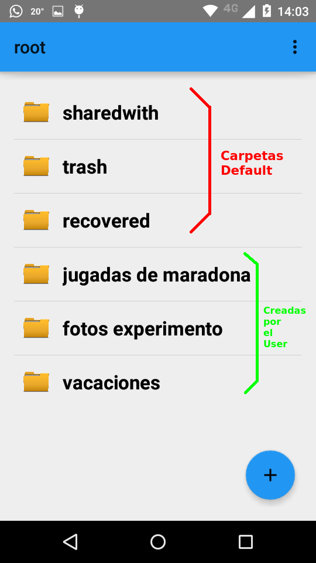
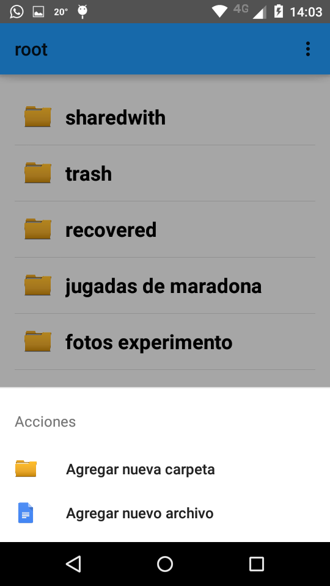
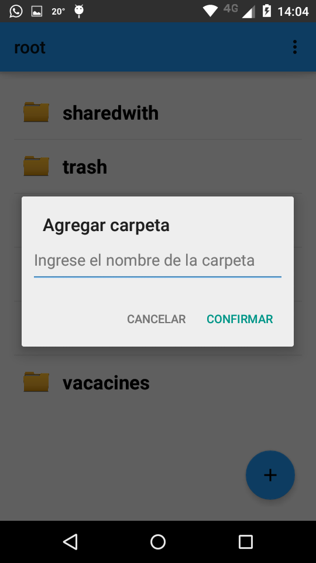
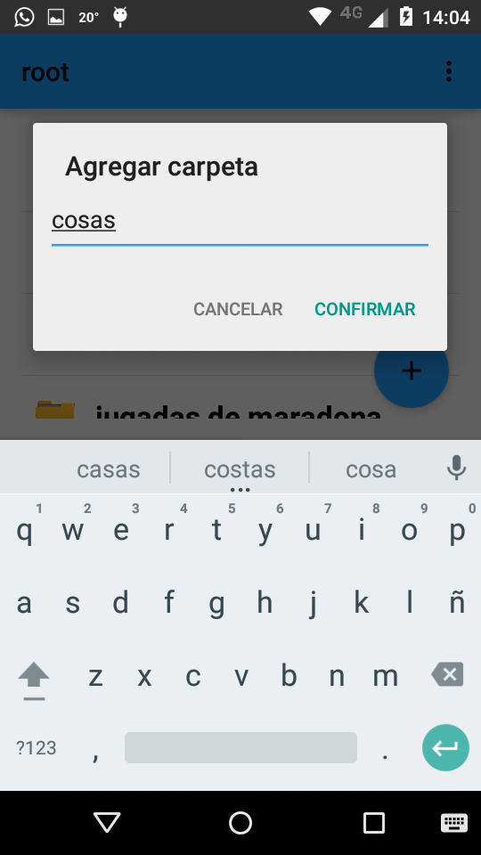
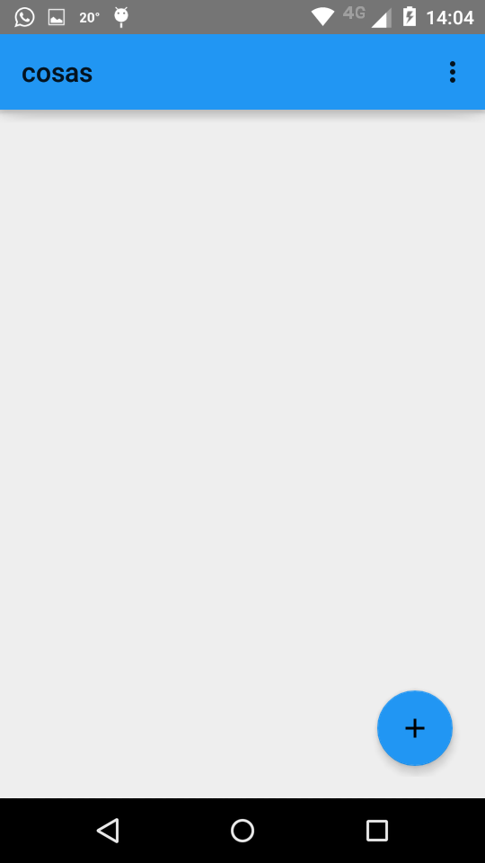
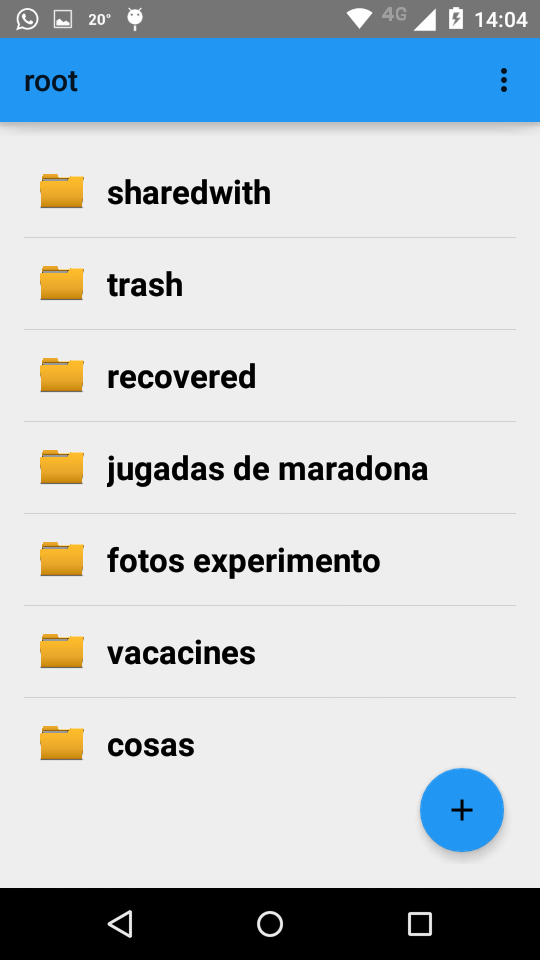
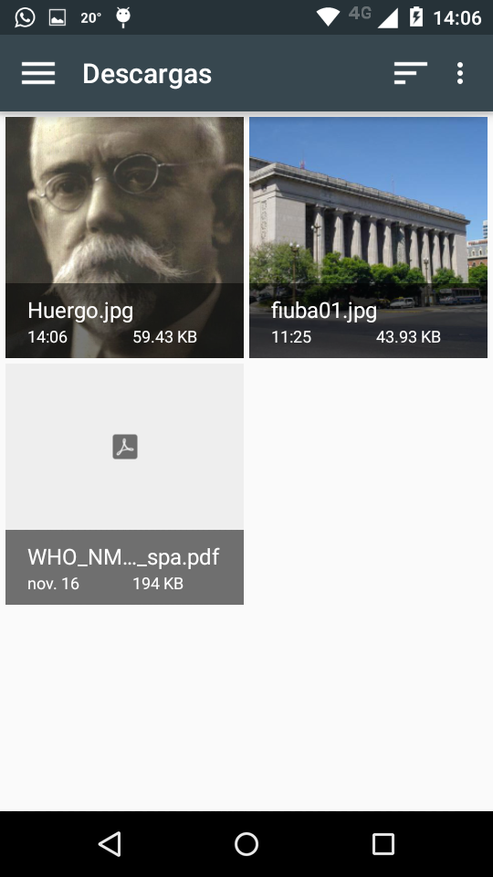
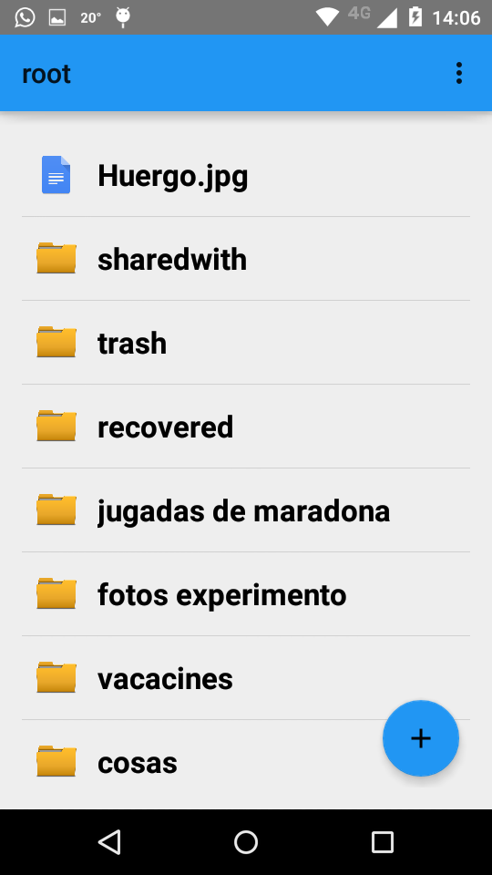

Pantalla general
================

Carpetas por default
--------------------

Las carpetas **sharewith** , **recovered**, **trash** son creadas por el sistema.

sharewith
^^^^^^^^^

Se ubican los archivos que le fueron compartidos al usuario por otros usuarios.

trash
^^^^^

Se ubican los archivos que el usuario eliminó.
Manteniendo presionado sobre 1 archivo, tenemos la posibilidad de visualizarlo, o recuperarlo.
Recuperarlo lo mueve a la carpeta recovered. Esto es necesario si se quiere seguir trabajando sobre el archivo ( modificarlo).

recovered
^^^^^^^^^

Se ubican los archivos que fueron eliminados, pero luego restaurados desde la carpeta trash.

Agregar nueva carpeta
---------------------

Hacer click en el **simbolo +** que se encuentra abajo a la derecha abre el siguiente menu: 

Cuando se termina de crear la carpeta, automaticamente :

Si usamos el boton de back y volvemos a la pantalla principal, podemos ver nuestra recientemente creada carpeta: 

Agregar nuevo archivo
---------------------

Hacer click en el **simbolo +** que se encuentra abajo a la derecha abre el siguiente menu: 

Click en "agregar nuevo archivo"

Cuando termina, volvemos a ver la carpeta donde estabamos, y podemos ver que el archivo que elegimos fue subido.

