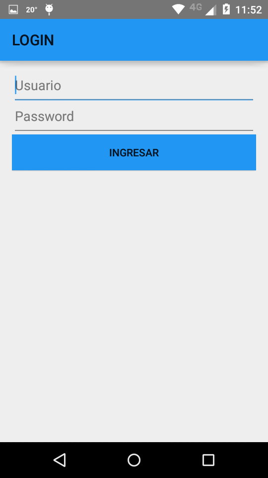
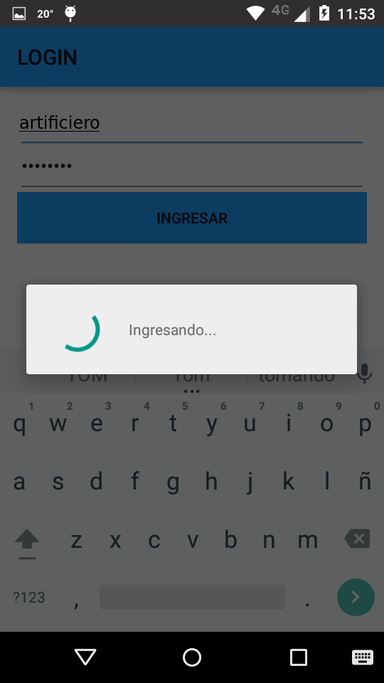
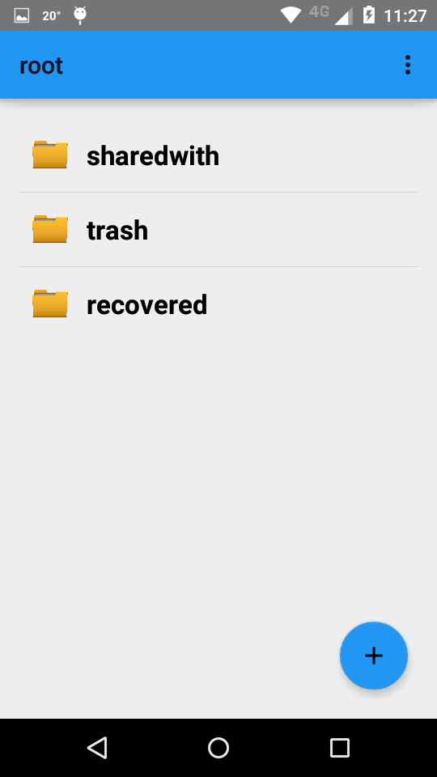

Inicio de sesión
================

Si ya se cuenta con un usuario, y se hizo click en Iniciar Sesion en la pantalla inicial, se nos dirigira a la siguiente pantalla:

* Los 2 campos son obligatorios.

* Si falta alguno, un pop up nos lo recordara.

Si se cumple alguna de las siguientes condiciones:

* Usuario no se encuentra registrado en el sistema
* Clave invalida

aparecera un pop up con la siguiente leyenda "Nombre de usuario o contraseña invalidos"

Si el usuario y la contraseña son correctos :

Y luego , la pantalla principal de la aplicación :

