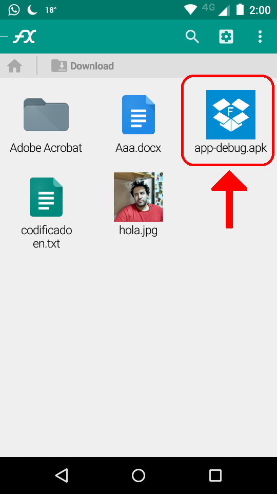

Instalación
===========

*	Ingresar a la configuracion de su celular ( buscar un icono similar al de la siguiente imagen )

*	Click en Seguridad

*	Activar Fuentes desconocidas

*	Cuando salga un pop up para confirmar el cambio, Aceptar

*	Descargar el apk al celular.

*	Navegar hasta la carpeta donde haya sido descargado.

Listo ! Ya puede empezar a disfrutar de Udrive
