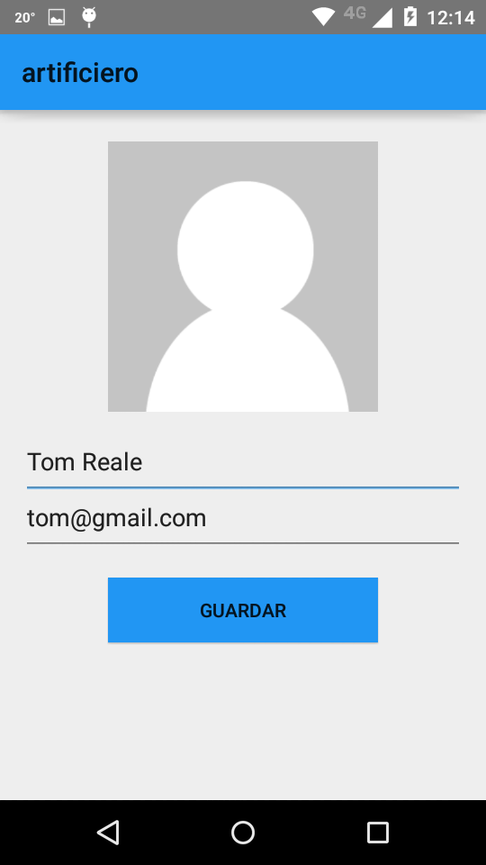
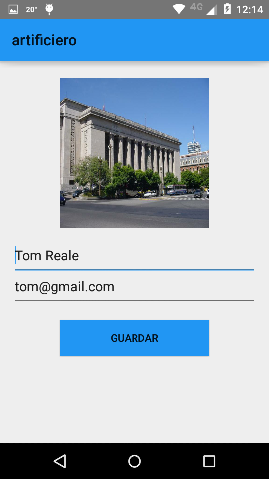

Perfil de usuario
=================

El perfil del usuario contiene el nombre de la persona y su imagen.
Es posible modificar esas 2 cosas. El nombre de usuario no se puede cambiar.

Estando en la pantalla general, si se hace click sobre los 3 puntos que se encuentran a la derecha arriba :

.. figure::  pantallaPrincipal3puntos.png
   :target: _images/pantallaPrincipal3puntos.png

Nos aparecera el siguiente menu :

.. figure::  perfil1.png
   :target: _images/perfil1.png

Al hacer click en Perfil :

A modo de ejemplo, consideraremos el caso de un usuario que no tiene imagen de perfil ( si ya tenia y queria cambiarla, es lo mismo).

Haciendo click en la imagen de perfil, se nos abre un menu con opciones para selecionar la nueva imagen. Una vez elegida :

Se puede modificar también el campo de nombre de persona.

Al hacer click en guardar, se vuelve a la pantalla principal. Un pop up nos indicara "perfil actualizado"