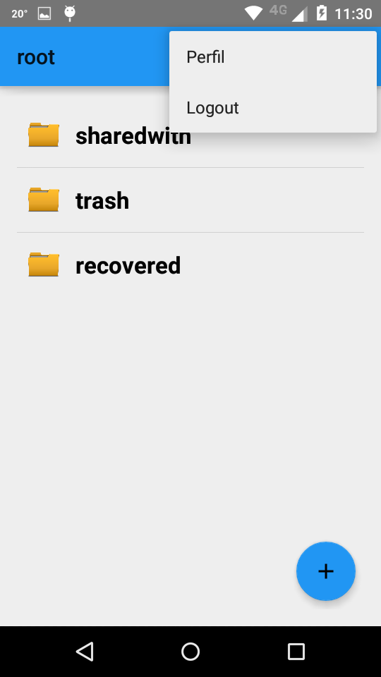

Perfil de usuario
=================

El perfil del usuario contiene el nombre de la persona , su mail y su imagen.
Es posible modificar el nombre el mail y la imagen. **El nombre de usuario no se puede cambiar.**

Desde la pantalla general, click sobre los 3 puntos que se encuentran a la derecha arriba :

.. figure::  pantallaPrincipal3puntos.png
   :target: _images/pantallaPrincipal3puntos.png

Nos aparecera el siguiente menu :

Al hacer click en Perfil :

.. figure::  perfilInicial.png
   :target: _images/perfilInicial.png

A modo de ejemplo, consideraremos el caso de un usuario que no tiene imagen de perfil ( si ya tenia y queria cambiarla, es lo mismo).

Haciendo click en la imagen de perfil, se nos abre un menu con opciones para selecionar la nueva imagen. Una vez elegida :

Aca tambien se pueden modificar el nombre de la persona y el mail.

Recordar el formato del mail "xxx@yyy.com"

Al hacer click en guardar, se vuelve a la pantalla principal. Un pop up nos indicara "perfil actualizado"