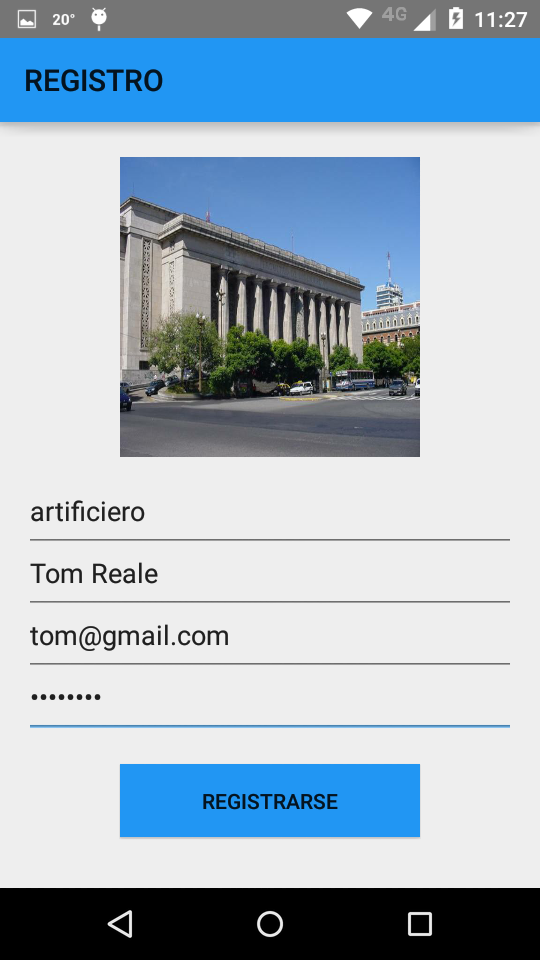
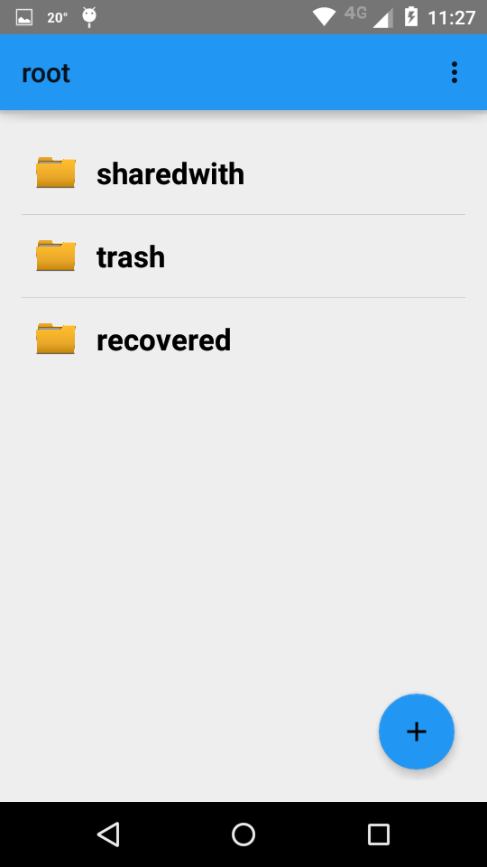

Registro de usuario
===================

Al hacer click en el boton REGISTRARSE de la pantalla inicial, se accede a la pantalla de registro.

* Nombre de usuario, nombre de la persona, email y password son obligatorios. La imagen de perfil no es obligatoria.
* El mail debe tener un formato valido "xxx@yyy.com".
* La clave debe tener al menos 6 caracteres.

Si no se cumple alguna condición, al intentar registrarse , un cartel nos indicara que condición no se esta cumpliendo.

Ejemplo de registro.

.. figure::  registro1.png
   :target: _images/registro1.png

Si se hace click sobre la imagen de perfil ( inicialmente vacia, solo se ve el contorno blanco de una persona contra un fondo gris ), se nos abre la posibilidad de elegir una imagen desde distintas fuentes.

A modo de ejemplo, clickearemos en la imagen de la fiuba

Finalmente, nos queda :

Al clickear en el boton REGISTRARSE, y si se cumplieron todas las condiciones, se ingresara a la pantalla principal de la applicacion, y aparecera un cartel de bienvenida.

De ahora en mas, se debera ir directamente al login para ingresar, usando el nombre de usuario y la clave aqui establecidas.
